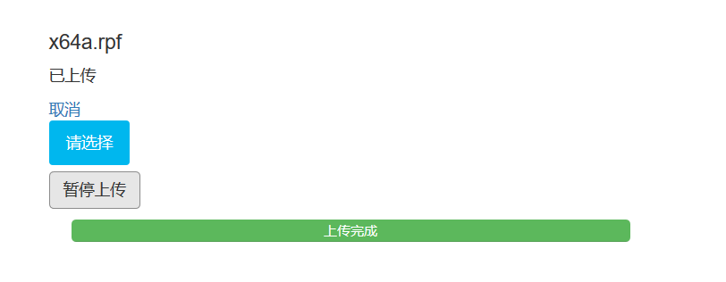
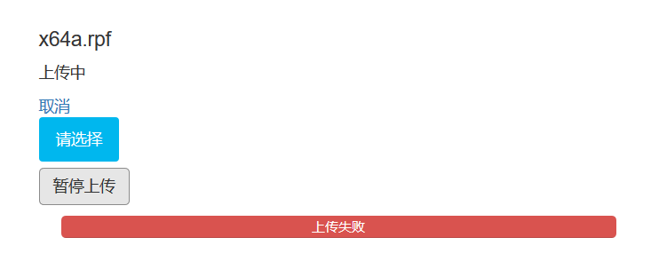

## 目的

* 前端采用分片方式上传大文件给后端，后端接收全部分片后，将其组合成一个文件  

* 支持多用户同时上传，互不干扰  

* 支持流式下载文件，低占用内存  

* 支持断点续传，断点下载

* python requests 断点下载demo

## 安装

* 通过<code>pip install -r requirements</code>安装所需包  

## 运行

* 命令行键入“./server.py runserver”启动服务器 or 直接运行

* 浏览器访问“127.0.0.1:5000 ”，点击“请选择”按钮，选择文件并上传  

* 浏览器访问“127.0.0.1:5000/file/list ”，点击一个上传的文件进行下载  

## 效果

* 文件上传成功

* 文件上传失败

## 技术

* Python语言，Flask框架  

* WebUploader分片与上传，Bootstrap渲染上传进度条  

* 上传大致思路：  
[blog.csdn.net/jinixin/article/details/77545140](http://blog.csdn.net/jinixin/article/details/77545140)  
  

* 下载案例来源：  
[stackoverflow.com/questions/24318084/flask-make-response-with-large-files](https://stackoverflow.com/questions/24318084/flask-make-response-with-large-files)  
  

## 致谢

* 提供开源框架的母公司  

* [hulkbai](https://github.com/hulkbai)  解决因编码造成的合并分片失败

* [CharlieLio](https://github.com/CharlieLio)  报告文件名乱码问题